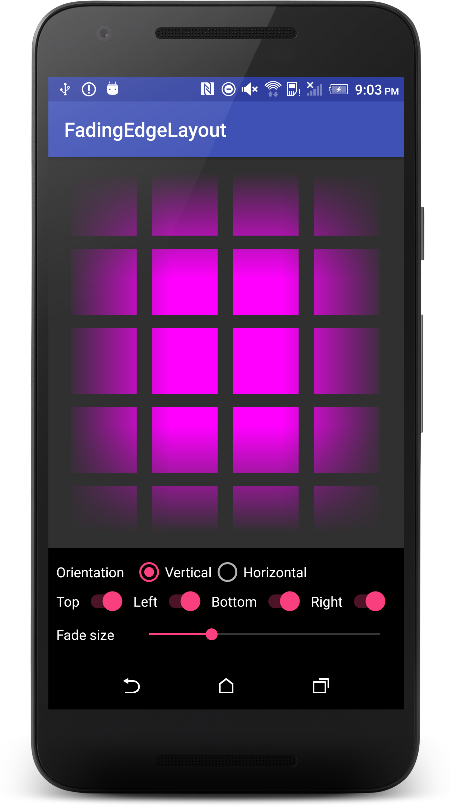
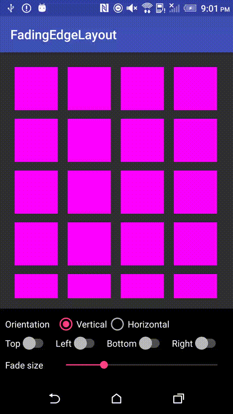

Android-FadingEdgeLayout
============================

A versatile layout that fades its edges regardless of child view type.

#### What is available:
* Four fading edges that are individually configurable
* Length of fading edge is adjustable
* Supports any type of child `View`





Usage
-----
```gradle
dependencies {
    compile 'com.github.bosphere.android-fadingedgelayout:fadingedgelayout:1.0.0'
}
```

```xml
<com.bosphere.fadingedgelayout.FadingEdgeLayout
    android:id="@+id/fading_edge_layout"
    android:layout_width="match_parent"
    android:layout_height="match_parent"
    app:fel_edge="top|left|bottom|right"
    app:fel_size_top="80dp"
    app:fel_size_bottom="80dp"
    app:fel_size_left="80dp"
    app:fel_size_right="80dp">

    <android.support.v7.widget.RecyclerView
        android:id="@+id/recycler_view"
        android:layout_width="match_parent"
        android:layout_height="match_parent"/>

</com.bosphere.fadingedgelayout.FadingEdgeLayout>
```

```java
FadingEdgeLayout mFadingEdgeLayout = ...;
mFadingEdgeLayout.setFadeEdges(mEnableTop, mEnableLeft, mEnableBottom, mEnableRight);
mFadingEdgeLayout.setFadeSizes(lenPx, lenPx, lenPx, lenPx);
```

The fading edges are not implemented as color overlay but rather linear gradient alpha mask of the content. So it'll naturally follow the color of the background.

Compatibility
-------------

API 7 (Android 2.1) and up

License
-------

Copyright 2017 Yang Bo

Licensed under the Apache License, Version 2.0 (the "License");
you may not use this file except in compliance with the License.
You may obtain a copy of the License at

   http://www.apache.org/licenses/LICENSE-2.0

Unless required by applicable law or agreed to in writing, software
distributed under the License is distributed on an "AS IS" BASIS,
WITHOUT WARRANTIES OR CONDITIONS OF ANY KIND, either express or implied.
See the License for the specific language governing permissions and
limitations under the License.